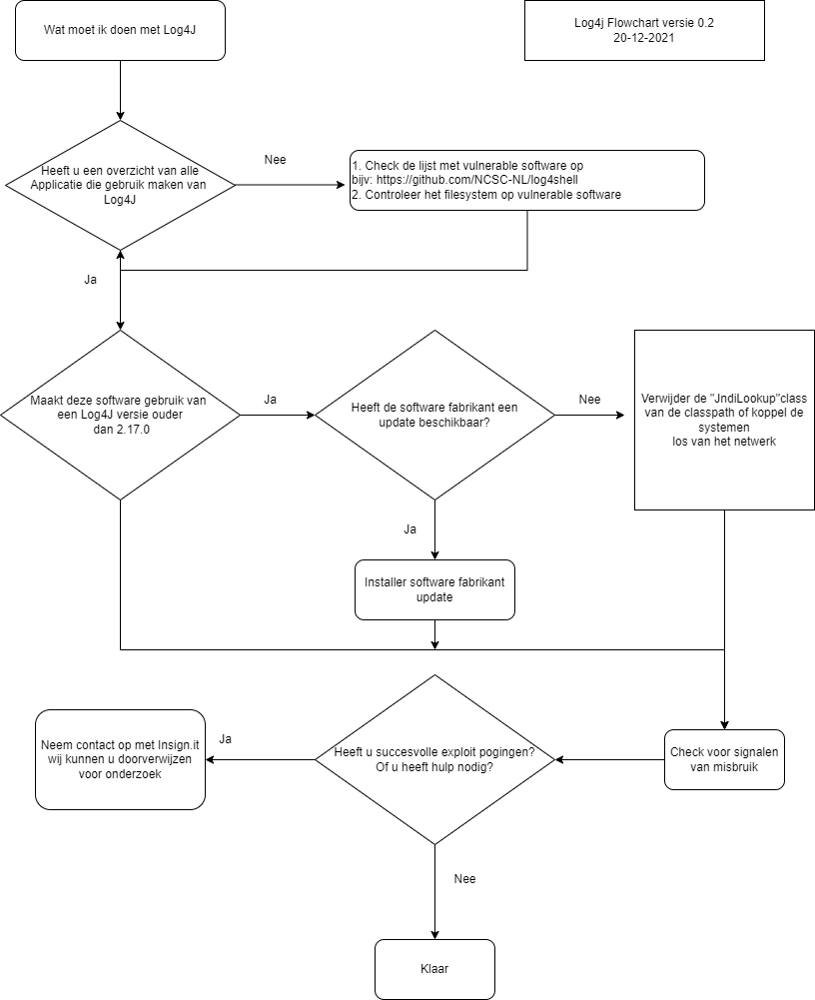

# CVE-2021-44228 Apache Log4J + CVE-2021-45046

Middels deze github pagina houden wij u op de hoogte rondom de kwetsbaarheid CVE-2021-44228 en de nieuwe CVE-2021-45046
Op internet ook bekend onder Log4j

## Updated information

De CVE score van de tweede CVE=2021-45046 is opgeschaald van 3.7 -> 9.0 (beperkte DOS)

## Hoe kan ik me nog beschermen op dit moment.

Aangezien de informatie steeds wijzigd over deze CVE's is het voor veel mensen onduidelijk hoe je nu kunt beschermen. Ons advies is volg de adviezen van je software fabrikant op en bij twijfel ***Zet je systemen uit***

### Permanante bescherming

Upgraden naar versie 2.17.0. Deze versie is niet kwetsbaar voor Remote code excectution en DOS vulnerabilities.

### Tijdelijke bescherming

The FORMATMSGNOLOOKUPS workaround beschermt niet in alle gevallen.
Je moet upgraden naar versie 2.17.0 of gebruik maken van de JNDI patches voor tijdelijke bescherming.

## Algemeen

Zoals u via onze berichtgeving of in de media heeft vernomen uit de nieuwberichten is een ernstige kwetsbaarheid aangetroffen in de veelgebruikte opensourcetool Apache Log4j die gebruikt wordt voor het loggen van Java-applicaties (als voorbeeld wordt deze oplossing veel gebruikt voor web toepassingen). De kwetsbaarheid heeft de aanduiding CVE-2021-44228 gekregen en staat ook bekend als Log4Shell of LogJam of Log4j. Het NCSC schaalt de impact van deze kwetsbaarheid in als risico HIGH/ impact HIGH! 

Inmiddels is ook bekend dat er reeds exploits beschikbaar zijn welke kwaadwillige hackers inzetten om misbruik te maken van dit ernstig lek. 

**Neem contact op met uw leveranciers die gebruikmaken van deze opensource tool in hun oplossingen. Apache heeft inmiddels nieuwe updates uitgebracht om de kwetsbaarheid te verhelpen. Vooral servers welke aan internet zijn gekoppeld zijn direct kwetsbaar (er kan direct misbruik worden gemaakt).** 

Het is zeer eenvoudig misbruik te maken van dit lek en we zien op dit moment ook actief misbruik.

## Flowchart

## Beveiligings Advies

[CVE-2021-4228](https://www.ncsc.nl/actueel/advisory?id=NCSC%2D2021%2D1052)

## Product Portofolio

| Vendor         | Info                                                                                                                                                                                                                                                  |
| -------------- | ----------------------------------------------------------------------------------------------------------------------------------------------------------------------------------------------------------------------------------------------------- |
| HiveIO / Atlantis USX | https://support.hiveio.com/portal/en/kb/articles/cve-2021-44228
| Cisco          | [https://tools.cisco.com/security/center/content/CiscoSecurityAdvisory/cisco-sa-apache-log4j-qRuKNEbd](https://tools.cisco.com/security/center/content/CiscoSecurityAdvisory/cisco-sa-apache-log4j-qRuKNEbd)                                          |
| Citrix         | https://support.citrix.com/article/CTX335705                                                                                                                                                                                                          |
| Dell           | [https://www.dell.com/support/kbdoc/nl-nl/000194414/dell-response-to-apache-log4j-remote-code-execution-vulnerability](https://www.dell.com/support/kbdoc/nl-nl/000194414/dell-response-to-apache-log4j-remote-code-execution-vulnerability)          |
| Eset           | [https://forum.eset.com/topic/30691-log4j-vulnerability/](https://forum.eset.com/topic/30691-log4j-vulnerability/)                                                                                                                                    |
| Extreme        | [https://extremeportal.force.com/ExtrArticleDetail?an=000100806&\_ga=2.8924661.1942628706.1639384902-1261081976.1634634957](https://extremeportal.force.com/ExtrArticleDetail?an=000100806&_ga=2.8924661.1942628706.1639384902-1261081976.1634634957) |                                                                                                                                                                                                                                            |
| Ivanti         | No vulnerable                                                                                                                                                                                                                                         |
| Netapp         | https://security.netapp.com/advisory/ntap-20211210-0007/                                                                                                                                                                                              |
| Vmware         | https://www.vmware.com/security/advisories/VMSA-2021-0028.html                                                                                                                                                                                        |
| Oracle         | https://www.oracle.com/security-alerts/alert-cve-2021-44228.html                                                                                                                                                                                      |
| Palo           | https://security.paloaltonetworks.com/CVE-2021-44228                                                                                                                                                                                                  |
| Pure Storage   | https://support.purestorage.com/Field_Bulletins/Interim_Security_Advisory_Regarding_CVE-2021-44228_log4j          |
| Ubiquiti Unify | https://community.ui.com/releases/UniFi-Network-Application-6-5-54/d717f241-48bb-4979-8b10-99db36ddabe1                                                                                                                                               |
| Veeam          | https://www.veeam.com/kb4254                              |
| Mailmarshall   |                                                                                                                                                                                                                                                       |
| Igel           | https://kb.igel.com/securitysafety/en/isn-2021-11-ums-log4j-vulnerability-54086712.html |                                                                   
| Synology        |https://www.synology.com/en-us/security/advisory/Synology_SA_21_30 |

## Kwetsbare applicaties

Veel applicaties maken op de achtergrond gebruik van Apache Log4J. Daarom adviseren wij
met klem:

***Neem contact op met uw leveranciers die gebruikmaken van deze opensource tool in hun oplossingen***

Het NCSC heeft een lijst online geplaatst op Github met applicaties die kwetsbaar zijn als gevolg van de ernstige kwetsbaarheid in Log4j. Deze lijst is nog lang niet volledig en zal de komende dagen aangevuld worden met informatie over applicaties die nog niet op de lijst staan. 

[Actuele lijst met kwetsbare applicaties ](https://github.com/NCSC-NL/log4shell/tree/main/software)

## Actuele informatie NCSC

[Github NCSC](https://github.com/NCSC-NL/log4shell/)